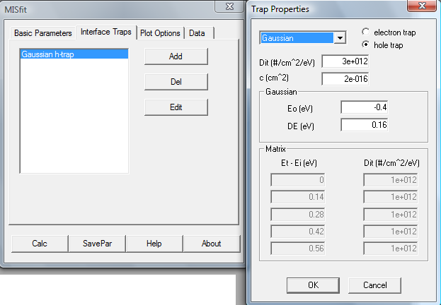
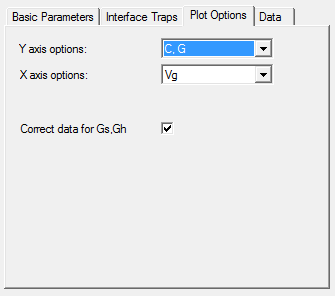
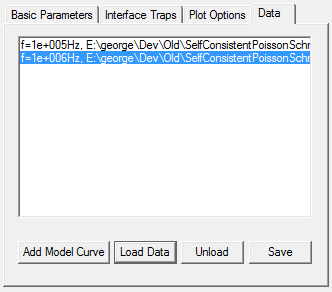

# MISfit 
a  program for analyzing simultaneously capacitance-voltance (C-V) and conductance-voltage (G-V) curves from metal-insulator-semiconductor (MIS) structures

for Win32 (XP/Windows 7/Windows 10)

**Contents:** 

  - [Introduction](#introduction)
  - [Physics Background](#physics-background)
  - [Usage](#usage)
    - [Basic Parameters](#basic-parameters)
    - [Interface Traps](#interface-traps)
    - [Plot Options](#plot-options)
    - [Data](#data)
  - [Installation and Testing](#installation-and-testing)
  - [Compile from source](#compile-from-source)
  - [Lisence](#lisence)
  - [References](#references)

## Introduction

MISfit simulates the capacitance, C, and conductance, G, of MIS devices as a function of the applied gate voltage, Vg, and frequency. Features of the program include:

* Semiconductor material: Si, Ge, GaAs
* Charge quantization effects in the semiconductor
* Interface trap states with Schockley-Read-Hall dynamics
* Different kinds of trap distributions (Uniform, Gaussian, etc.)
* Series and shunt resistance effects included

## Physics Background

For an introduction to the basic MIS physics one can look in the books of  Sze [1] or Nicollian and Brews [2]. Here a very short description is given, with the main purpose to clarify the definitions of the various quantities calculated by the MISfit program. For a more detailed discussion of the theory behind the calculations please consult the paper by Apostolopoulos *et al.* [3].

The following figure shows the MIS structure and its equivalent circuit. $C_i$, $C_s$, and $C_{it}$ are the capacitances of the insulator, the semiconductor, and the interface states, respectively. Vg is the applied gate voltage and $Y = G + iωC$ is the total complex admittance of the equivalent circuit. MISfit calculates Y as a function of Vg and displays the results in two graphs, one for the capacitance and one for the conductance.

The insulator capacitance is a constant given by the user. The semiconductor and interface capacitances are calculated by the program. The following figure shows schematically the band structure of the semiconductor near the interface (as an example, a n-type semiconductor is considered biased to accumulation)

The gate voltage applied to the metal is distributed inside the structure. This potential distribution is depicted $V(x)$ in the above picture. Note that $V(x)$ is the potential energy of an electron, measured in eV, and has opposite sign from $V_g$. In the notation of Sze, $V(x) = -|e|\psi_s$. The value of $V(x)$ at the interface is the surface potential $V_s = V(x=0)$. Due to the band bending, electrons are accumulated near the interface with a density $n(x)$. The total charge in the semiconductor is $Q_s =\int{n(x)dx}$.

To gain calculation speed, MISfit has pre-calculated tables of the semiconductor charge $Q_s$ and capacitance $C_s = dQ_s/dV_s$ as a function of the surface potential $Vs$. These tables have been produced for various doping levels either by the semi-classical approximation, where charge densities are given by the proper Fermi integrals, or by a self-consistent solution of the Poisson and Scroedinger equations in one dimension. In the latter case the sub-bands of electrons and holes are taken into account [the semiconductor surface is assumed parallel to the (100) planes]. The program finds the actual values of $Qs$ and $Cs$ by interpolation in these tables.

A distribution of trap states may be present at the interface. They are depicted by the curve $D_{it}$ in the above figure. The user may choose among different types of distributions for the traps (Uniform, Gaussian, etc.). The traps are filled up to the Fermi level. The energy levels of traps are given with reference to the intrinsic Fermi level of the semiconductor, $E_i$. MISfit has an option to plot the results as a function of $E_{fs}-E_i$, where $E_{fs}$ is the Fermi level at the interface, to assist the user in selecting the proper energy levels for the trap state density models. The total charge stored in the traps is found by integrating the density $Q_{it} = \int{D_{it}(E) f(E) dx}$, where $f(E)$ is the probability of occupation of a trap state at energy E. The admittance of the interface at an excitation frequency w is calculated in the framework of the Schockley-Read-Hall theory.

## Usage

The program has two windows: one dialog for data and command input and one plot window where graphs of the measured and calculated $C$ and $G/\omega$ are shown:

The dialog window has four tabs for entering parameters:
* Basic Parameters
* Interface Traps
* Plot Options
* Data

There are also four main command buttons.

* *Calc.* Performs the actual calculation. It should be pressed when data or model parameters have been changed.
* *SavePar.* Exports the model parameters to a text file.
* *Help.* Displays this help file.
* *About.* Displays an “About” dialog box.

The plot window has some basic functionality for changing the graphs. By right-clicking on the axes the user can change between linear and log scale, set axis limits or choose autoscale. By right-clicking inside the graph one can zoom with the mouse.

### Basic Parameters

In this tab the basic parameters of the MIS model are given. It is divided in four sections:
1. *Insulator.* Here the user specifies the insulator specific capacitance, $C_i$, in µF/cm$^2$. After pressing “Calc” the program will calculate the equivalent SiO$_2$ oxide thickness, EOT, in nm. EOT is the SiO$_2$ thickness yielding the same $C_i$.
2. *Substrate.* Here the desired semiconductor material may be selected (Si, Ge or GaAs). It can be n- or p-type with a doping concentration in the range $10^{13}$ to $10^{18}$. If “Charge Quantization” is checked, quantum effects in the semiconductor are taken into account.
3. *Parasitic conductances.* The user may specify a series and parallel (shunt) parasitic conductance in S/cm2. These are taken into account when calculating the MIS curves (see also the Plot Options and Data tabs).
4. *Flat band shift.* A shift may be input in volts. This effectively shifts the Vg-axis of the MIS curves. Often such a shift has to be introduced in order to simulate experimental C-V curves. The physical origin of the shift may be the metal-semiconductor work function difference, the presence of fixed charges within the insulator, or the interface trapped charge.
When interface traps are entered in the model, the “Trap Shift” box shows the portion of Vfb due to the interface traps.

### Interface Traps

In this tab the properties of interface trap states are specified. By pressing “Add”, the “Trap Properties” dialog opens and the following options are available:
* Type of trap state distribution (Uniform, Gaussian, Lorentzian or 5-point matrix).
* If it is an electron or hole trap.
* The trap state density $D_{it}$ in units of (states / cm$^2$ / eV).
* The capture cross-section in cm$^2$.

The trap distribution is defined as
$$D(E_t - E_i) = D_{it}  f(E_t - E_i)$$
where $E_t$ is the energy level of the trap and $E_i$ the semiconductor intrinsic Fermi level ($E_i$ is approximately at mid-gap). $f(E)$ is the trap distribution function. If “Uniform” is selected then $f(E)=1$ everywhere within the gap. If the selected distribution is “Gaussian” then 
$$f(E) = \exp\left[ - (E – E_0)^2/\Delta E^2  \right]$$

The constants $E_0$ and $\Delta E$ are input at the corresponding boxes of the “Trap Properties” dialog. $E_0$ can be negative. In this case the peak of the distribution is below the mid-gap.
In the case of the 5-point matrix, the user specifies the value of $D(E_t-E_i)$ at 5 energy points. The program uses linear interpolation to calculate $D(E)$ within the range of energy values. Outside this range it is assumed that $D(E)=0$. The energy points must be entered in ascending order and can also include  negative values.

More than one interface trap models may be entered in the list of the “Interface Trap” tab. The traps may later be edited or removed by pressing the “Edit” and “Del” buttons, respectively.

### Plot Options

 
In this tab the user can select what is going to be shown in the plot window. For the y-axis there are 3 options:

* $C$ and $G/\omega$, i.e., the capacitance and conductance of the MIS device
* $Q_s$ and $Q_{it}$, i.e., the semiconductor and interface charge, respectively
* $C_s$ and $Q_s$, i.e., the semiconductor capacitance and charge

For the x-axis the are also 3 options:

* $V_g$, the gate voltage in Volts
* $V_s$, the semiconductor surface potential. Note that this is in eV and has a different sign from Vg (it is a voltage multiplied by the electron charge to convert to energy)
* $E_{fs} – E_i$, the difference of the Fermi level at the semiconductor surface from the intrinsic Fermi level. This is useful when looking at the interface states.

Finally the check box “Correct data for Gs,Gh” has the following function: When it is checked, the experimental data are corrected for the effects of parasitic conductances. The plot window then displays the corrected data and the simulation. When it is unchecked the plot window displays the raw data and the conductance correction is applied to the simulated curves. This affects also the way that results are saved (see the Data tab).

### Data

In this tab the user can import/export data and model curves. There are four buttons:

* *Add Model Curve.* For pure simulation purposes.
* *Load Data.* The program prompts for a data file. It should be a text file containing the experimental data in three columns: $V_g$ (in Volts), capacitance $C$ (in µF/cm$^2$) and conductance $G/\omega$ (in µF/cm$^2$). Note that $\omega = 2 \pi f$. The program also prompts for the frequency value, $f$, which is entered in Hz. 
* *Unload.* Removes the selected data set from memory.
* *Save.* Exports the selected data set to a text file. All quantities of the simulation, including the experimental data, are exported in tab-separated column format. If the check box “Correct data for Gs,Gh” in the Plot tab is checked, the experimental data will be corrected for parasitic conductance.
  
## Installation and Testing

To install just download and unzip the contents of "misfit-x.x.zip" to a folder and run "misfit.exe".

To test the program you may use sample data found in the folder `\testdata`.

Follow these steps:

   1. Go to the Data tab and press Load. Select the file `m100kHz.dat`, enter the frequency (100000 Hz).
   2. Repeat for the file `m1MHz.dat` (f=1000000Hz)
   3. Go to the Basic Parameters tab and enter $C_i=3$, p-type Si with $5\times 10^{15}$ doping level and charge quantization, $G_s=26$, $G_h=0.0002$, $V_{fb}=-0.53$
   4. Press Calc to see your results so far
   5. Go to Interface trap tab and Add a hole trap with $D_{it}=3\times 10^{12}$, $c=5\times 10^{-16}$, $E_0=-0.4$, $\Delta E=0.16$
   6. Press Calc
   7. Go to the Plot Options tab and select Correct for Gs,Gh. Press Calc

## Compile from source

MISfit has been developed with Microsoft Visual Studio 6.0 using MFC for the UI. This development environment can be installed in all Windows versions, even in Windows 10 (see [here](https://www.codeproject.com/Articles/1191047/Install-Visual-Studio-on-Windows) for example).

Load the workspace file `misft.dsw` in the MSVC6 IDE and press `Build all`.

The code is divided into 3 library sub-projects (`cppmath`, `graph`, `scps`) and the main program `misfit`. Refer to the READMEs under each folder for more information.

## Lisence

MIT
   
## References

1. S. M. Sze, “Physics of Semiconductor Devices”, Wiley, 1981
2. E. H. Nicollian and J R Brews, “MOS Physics and Technology”, Wiley, 1982
3. G. Apostolopoulos, G. Vellianitis, A. Dimoulas, J. C. Hooker and T. Conard, Applied Physics Letters, vol. 84, p. 260 (2004) [doi:10.1063/1.1639942](https://dx.doi.org/10.1063/1.1639942)