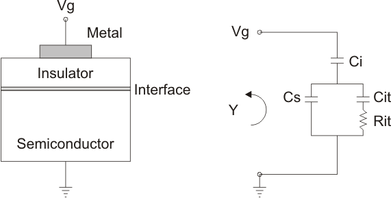
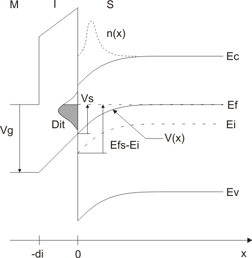
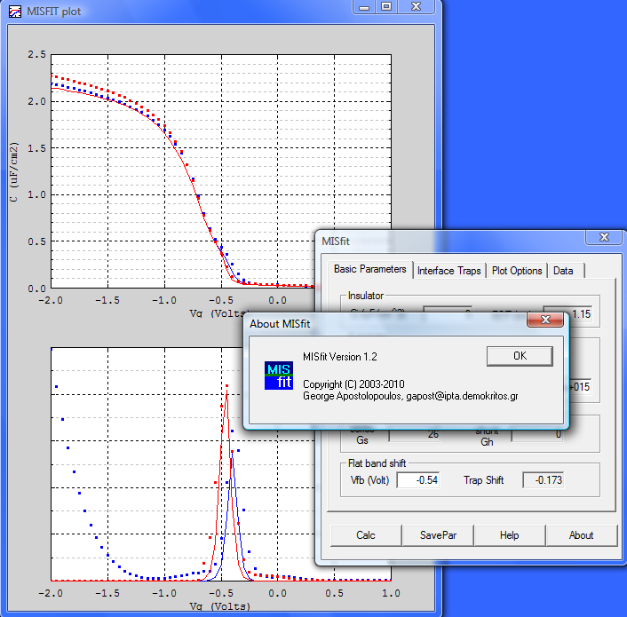
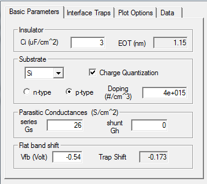

# MISfit 
a  program for analyzing simultaneously capacitance-voltance (C-V) and conductance-voltage (G-V) curves from metal-insulator-semiconductor (MIS) structures

## Introduction
MISfit simulates the capacitance, C, and conductance, G, of MIS devices as a function of the applied gate voltage, Vg, and frequency. Features of the program include:

* Semiconductor material: Si, Ge, GaAs
* Charge quantization effects in the semiconductor
* Interface trap states with Schockley-Read-Hall dynamics
* Different kinds of trap distributions (Uniform, Gaussian, etc.)
* Series and shunt resistance effects included

## Physics Background
For an introduction to the basic MIS physics one can look in the books of  Sze  or Nicollian and Brews. Here a very short description is given, with the main purpose to clarify the definitions of the various quantities calculated by the MISfit program. For a more detailed discussion of the theory behind the calculations please consult the paper by Apostolopoulos *et al.*

The following figure shows the MIS structure and its equivalent circuit. $C_i$, $C_s$, and $C_{it}$ are the capacitances of the insulator, the semiconductor, and the interface states, respectively. Vg is the applied gate voltage and $Y = G + iωC$ is the total complex admittance of the equivalent circuit. MISfit calculates Y as a function of Vg and displays the results in two graphs, one for the capacitance and one for the conductance.

The insulator capacitance is a constant given by the user. The semiconductor and interface capacitances are calculated by the program. The following figure shows schematically the band structure of the semiconductor near the interface (as an example, a n-type semiconductor is considered biased to accumulation)

The gate voltage applied to the metal is distributed inside the structure. This potential distribution is depicted $V(x)$ in the above picture. Note that $V(x)$ is the potential energy of an electron, measured in eV, and has opposite sign from $V_g$. In the notation of Sze, $V(x) = -|e|\psi_s$. The value of $V(x)$ at the interface is the surface potential $V_s = V(x=0)$. Due to the band bending, electrons are accumulated near the interface with a density $n(x)$. The total charge in the semiconductor is $Q_s =\int{n(x)dx}$.

To gain calculation speed, MISfit has pre-calculated tables of the semiconductor charge $Q_s$ and capacitance $C_s = dQ_s/dV_s$ as a function of the surface potential $Vs$. These tables have been produced for various doping levels either by the semi-classical approximation, where charge densities are given by the proper Fermi integrals, or by a self-consistent solution of the Poisson and Scroedinger equations in one dimension. In the latter case the sub-bands of electrons and holes are taken into account [the semiconductor surface is assumed parallel to the (100) planes]. The program finds the actual values of $Qs$ and $Cs$ by interpolation in these tables.

A distribution of trap states may be present at the interface. They are depicted by the curve $D_{it}$ in the above figure. The user may choose among different types of distributions for the traps (Uniform, Gaussian, etc.). The traps are filled up to the Fermi level. The energy levels of traps are given with reference to the intrinsic Fermi level of the semiconductor, $E_i$. MISfit has an option to plot the results as a function of $E_{fs}-E_i$, where $E_{fs}$ is the Fermi level at the interface, to assist the user in selecting the proper energy levels for the trap state density models. The total charge stored in the traps is found by integrating the density $Q_{it} = \int{D_{it}(E) f(E) dx}$, where $f(E)$ is the probability of occupation of a trap state at energy E. The admittance of the interface at an excitation frequency w is calculated in the framework of the Schockley-Read-Hall theory.

## Usage
The program has two windows: one dialog for data and command input and one plot window where graphs of the measured and calculated $C$ and $G/\omega$ are shown:

The dialog window has four tabs for entering parameters:
* Basic Parameters
* Interface Traps
* Plot Options
* Data

There are also four main command buttons.

* *Calc.* Performs the actual calculation. It should be pressed when data or model parameters have been changed.
* *SavePar.* Exports the model parameters to a text file.
* *Help.* Displays this help file.
* *About.* Displays an “About” dialog box.

The plot window has some basic functionality for changing the graphs. By right-clicking on the axes the user can change between linear and log scale, set axis limits or choose autoscale. By right-clicking inside the graph one can zoom with the mouse.

### Basic Parameters

In this tab the basic parameters of the MIS model are given. It is divided in four sections:
1. *Insulator.* Here the user specifies the insulator specific capacitance, $C_i$, in µF/cm$^2$. After pressing “Calc” the program will calculate the equivalent SiO$_2$ oxide thickness, EOT, in nm. EOT is the SiO$_2$ thickness yielding the same $C_i$.
2. *Substrate.* Here the desired semiconductor material may be selected (Si, Ge or GaAs). It can be n- or p-type with a doping concentration in the range 1013 to 1018. If “Charge Quantization” is checked, quantum effects in the semiconductor are taken into account.
3. *Parasitic conductances.* The user may specify a series and parallel (shunt) parasitic conductance in S/cm2. These are taken into account when calculating the MIS curves (see also the Plot Options and Data tabs).
4. *Flat band shift.* A shift may be input in volts. This effectively shifts the Vg-axis of the MIS curves. Often such a shift has to be introduced in order to simulate experimental C-V curves. The physical origin of the shift may be the metal-semiconductor work function difference, the presence of fixed charges within the insulator, or the interface trapped charge.
When interface traps are entered in the model, the “Trap Shift” box shows the portion of Vfb due to the interface traps.